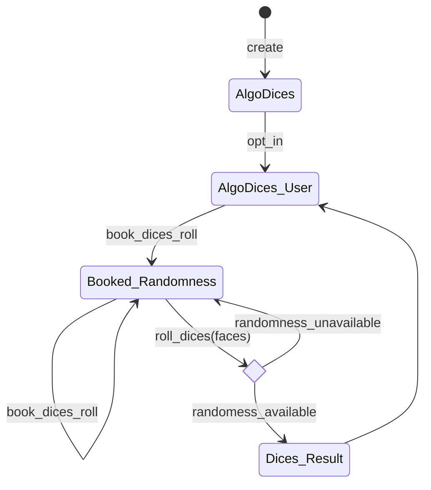

🎲 AlgoDices
------------
Let's roll your dices on Algorand!

## Overview
AlgoDices let players **roll dices on-chain** (both
[TestNet](https://testnet.algoexplorer.io/application/149459287)
and [MainNet]()), thanks the [*Randomness Beacon Application*](https://developer.algorand.org/articles/usage-and-best-practices-for-randomness-beacon/).

Starting from AVM 7, Algorand enables [turstless randomness on chain](https://developer.algorand.org/articles/randomness-on-algorand),
thanks to the use of [VRF](https://en.wikipedia.org/wiki/Verifiable_random_function):
with the `vrf_verify` opcode an oracle Smart Contract can prove that a
*pseudo-random value* has been honestly computed off-chain through a VRF process
for a given blockchain round in the future.

AlgoDices makes use of the Randomness Beacon App deployed on
[TestNet](https://testnet.algoexplorer.io/application/110096026)
and [MainNet](https://algoexplorer.io/application/947957720),
which verifies, stores and provides the randomness to
other applications for a given (future) round according to [ARC-21](https://arc.algorand.foundation/ARCs/arc-0021).

## ABI
AlgoDices ABI exposes two methods:

1. `book_dices_roll`
2. `roll_dieces`

AlgoDices App requires players to opt-in.

### Book (future) dices roll
Players can book dices rolls for future round, committing to future
randomness:

```json
{
    "name": "book_dices_roll",
    "args": [
        {
            "type": "uint64",
            "name": "future_round",
            "desc": "Future round booked for dices roll"
        }
    ],
    "returns": {
        "type": "void"
    },
    "desc": "Book dices roll for a future round."
}
```

#### Future round committment
Althogh the more the round is distant in the future the better is for security,
AlgoDices App does not impose any minimum `future_round`, leaving this check to
the client. An external App interacting with AlgoDices, for example, could
mandate `future_round` to be greater than current round plus `N`.

⚠️ Calling `book_dices_roll` twice will overwrite the last booked round, even if
the previous booked randomness is unused.

### Let's roll dices!
Once the booked randomness is available, players can roll dices with *"real"
number of faces* (`d2`, `d4`, `d6`, `d8`, `d10`, `d12`, `d20`, are common dices in
board games).

Players can roll multiple dices together (e.g. `2d6`, `1d8` and `1d20`),
up to 14.

⚠️ Players should wait at least for `future_round + 8` round to be sure that
their booked randomness is available in the Randomness Beacon App.

```json
{
    "name": "roll_dices",
    "args": [
        {
            "type": "application",
            "name": "randomness_beacon",
            "desc": "Randomness Beacon App ID (TestNet: 110096026, MainNet: 947957720)"
        },
        {
            "type": "uint8[]",
            "name": "dices",
            "desc": "Array of dices to roll (faces: 2, 4, 6, 8, 10, 12, 20)"
        }
    ],
    "returns": {
        "type": "uint8[]",
        "desc": "Dices roll result."
    },
    "desc": "Roll dices with a given number of faces. Fee: 3 * min_fee."
}
```

AlgoDice `dices_roll` returns an array containing the dices results.

## 🎰 Games
On-chain games can _call_ AlgoDices imposing their own rules, for example:
a `GameApp` calls `roll_die` two times (on behalf of players Alice and Bob
participating in the game through proxy Contract Accounts controlled by
GameApp) as Inner Transactions executed in the same GameApp Call, requiring
`dice = 6`. The highest result wins the match.

AlgoDices is also a _trustless dices roller_ to play board games and
RPGs (like D&D) "over-the-phone": players can safely roll dices remotely,
with no mean of cheating. A Dungeon Master could ask the Wizard Elf 🧝
to roll 8d6 to count Fireball damages 🔥 and be sure the result is correct!

## CLI
You can easily roll dices with the Python 🎲 AlgoDices CLI.

Clone `algo-dices` repo an open it:
```shell
$ git clone git@github.com:cusma/algo-dices.git
$ cd algo-dices
```

Install the virtual environment described in `Pipfile` using `pipenv`:
```shell
$ pipenv install
```

Lounch 🎲 AlgoDices CLI:
```shell
$ pipenv run python3 algodices.py

🎲 AlgoDices, let's roll verifiable random dices on Algornd!

Usage:
  algodices.py optin [--test]
  algodices.py book <future_rounds> [--test]
  algodices.py roll <dice> ... [--test]

Commands:
  optin    Subscribe to AlgoDices.
  book     Book a die roll in future round.
  roll     Roll dices (e.g. 2d6, 1d8 and 1d20: roll 6 6 8 20).

Options:
  -h, --help
  -t, --test
```

⚠️ AlgoDices is deployed both on TestNet and MainNet, use the `-t`
option to play on TestNet.

⚠️ AlgoDices CLI requires entering a mnemonic phrase formatted as:
`"word_1 ... word_25"`.

Example: roll 2d6, 1d8 and 1d20 on TestNet:
```shell
$ pipenv run python3 algodices.py roll 6 6 8 20 -t

 --- 🎰 RESULTS 🎰
 --- 🎲 d6:     1
 --- 🎲 d6:     5
 --- 🎲 d8:     1
 --- 🎲 d20:    17
```

## DappFlow
AlgoDices can be played also with [DappFlow ABI Studio](https://app.dappflow.org/abi-studio),
either on TestNet or MainNet, by logging with your wallet and importing
the AlgoDices `contract.json`.

## State Diagram



## Future developments (community welcome)

- [x] ~~Multiple dices rolls on single round (e.g. `[2d6, 1d8, 1d20]`);~~
- [ ] Contract Account proxy for players;
- [ ] Unlimited dices rolls (pay-per-roll).

## Credits
Thanks to [@ori-shem-tov](https://github.com/ori-shem-tov),
[@fabrice102](https://github.com/fabrice102) for the Randomness Oracle
Application and [@barnjamin](https://github.com/barnjamin) for the
[CoinFilpper](https://github.com/algorand-devrel/coin-flipper) example that
inspired AlgoDices.

Another special thanks again to [@fabrice102](https://github.com/fabrice102)
for the precious and clever considerations on "safe" randomness.
